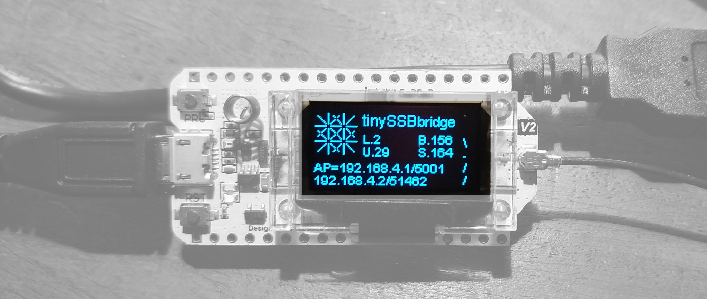

# A LoRa / Bluetooth / WiFi+UDP / USB -- Bridge for tinySSB

_2022-04-03 <christian.tschudin@unibas.ch>_

Abstract: A bridge for four different link layers is described that
serves as an interconnect for the development and deployment of
tinySSB. It works by forwarding an incoming tinySSB frame up to 120
bytes, received via one link layer technology, to the other three link
layer media.  One use case is a laptop without LoRa capability which
can now receive and send LoRa frames via UDP over WiFi. Alternatively,
the laptop can use Bluetooth or a USB cable in order to connect to the
bridge.

# 1) Overview



The ```tinySSBbridge``` has been programmed for the
[$\rightarrow$Heltec ESP32.V2](https://heltec.org/project/wifi-lora-32/)
device which support WiFi, Bluetooth and LoRa as well as serial
communication via the USB cable. Our bridge display a set of _four
counters_, reporting how many frames have been received on the
respective interface:

- L = LoRa
- U = WiFi+UDP, where the bridge runs in AccessPoint mode
  (SSID=```bridge```, password=```tiny-ssb```) at address ```192.168.4.1```,
  port ```5001```. When a client connects to the AP and sends a UDP packet
  to this port, the sender address is rememberd (for forwarding frames
  reveived via other media) and displayed on the last line. Only one
  WiFi-client at a time can be served by the bridge.
- B = Bluetooth, where the bridge advertizes itself as ```tinyssb-bridge```
  and serves the SSP profile (single character send and receive). Frames
  are delimited using the [$\rightarrow$KISS](http://www.ax25.net/kiss.aspx)
  protocol.
- S = USB(serial), where received frames are forwarded via USB to a computer,
  or received via USB cable to be forwarded on the other media. Frames are
  delimited using the [$\rightarrow$KISS](http://www.ax25.net/kiss.aspx)
  protocol.


# 2) Use Cases

We will use the following schematics to describe select use cases:

```

           LoRa            Bluetooth+KISS
               \.--------./
                | bridge |
               /`--------'\
       WiFi+UDP            USB cable+KISS
                
```

## 2.a) Using the tinySSB bridge as a LoRa-to-USB forwarder

The LoRa radio is configured for: 867.5 MHz, 250kHz BW, spreading
factor 7, 4/7 coding rate

```

     ( ( ( LoRa
               \.--------.
                | bridge |
                `--------'\
                           USB cable+KISS
```

On the laptop connected via USB, the corresponding COMM port has to be
found.  On MacOS, the path has the format
```/dev/tty.usbserial-0001``` and becomes visible once the bridge is
connected via USB. We use the ```serial``` Python package and initialize
it with ```115200 baud```.

In order to delimit frames in the stream of characters, we chose the
KISS protocol where ```0xC0``` is used as frame start and as frame end
marker.  Converting a byte packet into a framed version can programmed
in Python as follows:

```
def kiss_make_frame(pkt:byte): # returns an escaped byte string
    ba = bytearray(pkt)
    ba = ba.replace(FESC, FESC + TFESC).replace(FEND, FESC + TFEND)
    return bytes(FEND + ba + FEND)
```
where ```FEND=b'\xC0', FESC=b'\xDB', TFEND=b'\xDC', TFESC=b'\xDD'```.

On reception, using a Python object ```ser``` as returned by the
```serial``` package, KISS de-escaping works like this:

```
escmode = False
buf = bytearray[256]
buflen = 0

def kiss_read_frame(ser): # returns None or a byte string
    global escmode, buf, buflen
    while ser.in_waiting > 0:
        c = ser.read(1)
        if c == None or len(c) == 0: return None
        if c == FEND:
            escmode = False
            if buflen == 0: return None
            pkt, buflen = bytes(buf[:buflen]), 0
            return pkt
        if c == FESC:
            escmode = True
            continue
        if escmode:
            escmode = False
            if   c == TFESC: c = FESC
            elif c == TFEND: c = FEND
            else: continue
        if buflen < len(buf):
            buf[buflen] = c[0]
            buflen += 1
```

\newpage
If Bluetooth is used instead of a USB cable, the same KISS logic applies:
```
     ( ( ( LoRa            Bluetooth+KISS ) ) )
               \.--------./
                | bridge |
                `--------'
```
where (in Python) again a ```ser``` object can be used, this
time initialized for the ```/dev/tty.tinyssb-bridge``` serial device
that is created once the pairing is done.


## 2.b) Using the tinySSB bridge as a LoRa-to-UDP forwarder

The bridge acts as a WiFi access point (ssid=```bridge```,
pw=```tiny-ssb```) and listens on UDP port
```192.168.4.1/5001```. After connecting, a WiFi client must send a
UDP packet to this port in order to let the bridge learn the IP
address and UDP port of the peer. As long as the WiFi-connection is
maintained, incoming LoRa frames will be forwarded to this UDP port
and vice versa.

```
     ( ( ( LoRa
               \.--------.
                | bridge |
               /`--------'
 ( ( ( WiFi+UDP
```

## 2.c) Testing the KISS protocol implementation

The bridge can be used as a loopback device for testing
the KISS framing software:

```
                           Bluetooth+KISS  <--> UNIX process1 incl KISS
                .--------./
                | bridge |
                `--------'\
                           USB cable+KISS  <--> UNIX process2 incl KISS
```
Note that the bridge implements the KISS framing protocol, too:
A serially received frame will be de-escaped and sent
to all other interfaces, which in case of a serial output line
means to re-escape the packet according to the KISS protocol.


## 2.d) Using one bridge to let an Android Smartphone _and_ a Laptop access LoRa

Finally, a hypothetical scenario would be that the bridge serves
LoRa frames to several devices at the same time:

```
     ( ( ( LoRa
               \.--------.
Android         | bridge |
 |             /`--------'\
 ( ( ( WiFi+UDP            USB cable+KISS  <--> Laptop
```

Expect in this scenario an increased loss rates if packets to be
forwarded via LoRa arrive at too high rate. Also, the bridge software
is at risk of crashing.


# 3) A Note on Bluetooth (and WiFi)

Our bridge cannot operate Bluetooth and WiFi at the same time: while
both can be _connected_ simultaneously and if no frames are exchanged,
WiFi is dropped as soon as data is sent over the Bluetooth link.
Either the Arduino core and Espriff-Libraries have a problem, or there
is so severe interference on the (shared) 2.4GHz band that the WiFi
association between the laptop and the bridge is lost.

Note also that once you recompile the bridge binary you will have to
**unpair the bridge and pair it again**, as it looses the negotiated
pairing secret when the binary is flashed to the device.


# 4) Bridge packet processing time

An incoming packet is copied to all interface one after the other where
the actual send activity is sometimes carried out by an external chip.
One would therefore expect that the exact per-packet processing timing
is difficult to give and moreover depends which interface a packet
arrives from (because it will not be sent out on that
interface). However, we measured always approx 138 millisec processing
time per full tinySSB packet (120 bytes) that has to be sent via LoRa,
and 1 ms per received LoRa packet, as the following table
shows:


| incoming  | outgoing  | millisec/pkt |
|-----------|-----------|--------|
| LoRa      | USB       | 1 |
| LoRa      | USB, BT   | 1 |
| LoRa      | USB, WiFi | 1 |
| USB       | LoRa      | 137 |
| USB       | LoRa, BT  | 137 |
| USB       | LoRa, WiFi| 138 |
| Bluetooth | LoRa, USB | 138 |
| WiFi      | LoRa, USB | 138 | 

\centerline{Measured bridge processing times for a full 120B tinySSB packet}

\vskip 1em
The 137 millisec per 120 bytes LoRa packet correspond very well with
the overall air time for the chosen LoRa parameters. The three other
output channels are in the below 1ms range, even for the serial paths with
115200 bauds (where the UART might also do some buffering).

The 137ms/pkt processing and send time is not a problem in the sense
that LoRa requires duty cycling between 1 and 10%, translating to _one
tinySSB LoRa packet every 14 or 1.4 seconds_, respectively. This is not
enforced by the bridge and must be controlled by the sending tinySSB
software. The LoPy4 device from PyCom, for example, cannot send more
than one 120B packet per second (with the same LoRa parameters).

Note that the serial USB interface is always on (with LoRa, BT and
WiFi incomning) as there is no programmatic way to discover whether
the USB serial communication is active or not. Therefore, the
combinations without USB (WiFi-to-LoRa, BT-to-LoRa, as well as
Lora-to-{BT/WiFi}) do not appear in above table.


\newpage
# Appendix: Source Code


```
/*
  tinySSB LoRa-to-WiFiUDP/BT/USB bridge

  2022-04-02 <christian.tschudin@unibas.ch>
*/

// config:
#define AP_SSID   "bridge"
#define AP_PW     "tiny-ssb"
#define UDP_PORT   5001

#define BTname    "tinyssb-bridge"

#define LORA_FREQ  867500000L
// #define LORA_FREQ  868000000L

#include "heltec.h" 
#include "tinyssb-logo.h"
#include "WiFi.h"
#include "WiFiAP.h"
#include "BluetoothSerial.h"

#include <lwip/sockets.h>
#include <cstring>

// ------------------------------------------------------------------------------------

BluetoothSerial BT;
IPAddress myIP;
int udp_sock = -1;
struct sockaddr_in udp_addr; // wifi peer
unsigned int udp_addr_len;
short rssi, ap_client_cnt, err_cnt;
short lora_cnt, udp_cnt, bt_cnt, serial_cnt;
char wheel[] = "/-\\|";

// -------------------------------------------------------------------------------------

struct kiss_buf {
  char esc;
  unsigned char buf[256];
  short len;
};

struct kiss_buf serial_kiss, bt_kiss;

#define KISS_FEND   0xc0
#define KISS_FESC   0xdb
#define KISS_TFEND  0xdc
#define KISS_TFESC  0xdd

void kiss_write(Stream &s, unsigned char *buf, short len) {
  s.write(KISS_FEND);
  for (int i = 0; i < len; i++, buf++) {
    if (*buf == KISS_FESC) {
      s.write(KISS_FESC); s.write(KISS_TFESC);
    } else if (*buf == KISS_FEND) {
      s.write(KISS_FESC); s.write(KISS_TFEND);
    } else
      s.write(*buf);
  }
  s.write(KISS_FEND);
}

int kiss_read(Stream &s, struct kiss_buf *kp) {
  while (s.available()) {
    short c = s.read();
    if (c == KISS_FEND) {
      kp->esc = 0;
      short sz = 0;
      if (kp->len != 0) {
        // Serial.printf("KISS packet, %d bytes\n", kp->len);
        sz = kp->len;
        kp->len = 0;
      }
      return sz;
    }
    if (c == KISS_FESC) {
      kp->esc = 1;
    } else if (kp->esc) {
      if (c == KISS_TFESC || c == KISS_TFEND) {
        if (kp->len < sizeof(kp->buf))
          kp->buf[kp->len++] = c == KISS_TFESC ? KISS_FESC : KISS_FEND;
      }
      kp->esc = 0;
    } else if (kp->len < sizeof(kp->buf))
      kp->buf[kp->len++] = c;
  }
  return 0;
}

// -------------------------------------------------------------------------------------

void ShowIP() {
  Heltec.display->setColor(BLACK); 
  Heltec.display->fillRect(0, 42, DISPLAY_WIDTH, DISPLAY_HEIGHT-42);
  Heltec.display->setColor(WHITE); 
  
  Heltec.display->drawString(0, 43, "AP=" + myIP.toString() + "/" + String(UDP_PORT));
  String str = IPAddress(udp_addr.sin_addr.s_addr).toString() + "/" + String(ntohs(udp_addr.sin_port));
  Heltec.display->drawString(0, 53, str);
}

void ShowWheels() {
  Heltec.display->setColor(BLACK); 
  Heltec.display->fillRect(DISPLAY_WIDTH-10, DISPLAY_HEIGHT-40, 10, 40);
  Heltec.display->setColor(WHITE);
  String str = " ";
  str[0] = wheel[lora_cnt % 4];   Heltec.display->drawString(DISPLAY_WIDTH-10, 22, str);
  str[0] = wheel[udp_cnt % 4];    Heltec.display->drawString(DISPLAY_WIDTH-10, 32, str);
  str[0] = wheel[bt_cnt % 4];     Heltec.display->drawString(DISPLAY_WIDTH-10, 42, str);
  str[0] = wheel[serial_cnt % 4]; Heltec.display->drawString(DISPLAY_WIDTH-10, 52, str);
}

void ShowCounters(){
  String str;
  Heltec.display->setColor(BLACK); 
  Heltec.display->fillRect(38, 20, DISPLAY_WIDTH-38, 22);
  Heltec.display->setColor(WHITE); 

  str = String(lora_cnt, DEC);   Heltec.display->drawString(38, 20, "L."+ str);
  str = String(udp_cnt, DEC);    Heltec.display->drawString(38, 30, "U."+ str);
  str = String(bt_cnt, DEC);     Heltec.display->drawString(82, 20, "B."+ str);
  str = String(serial_cnt, DEC); Heltec.display->drawString(82, 30, "S." + str);
  // rssi
  // str = String(err_cnt, DEC);  Heltec.display->drawString(90, 30, "e:");
  //                             Heltec.display->drawString(99, 30, str);
}

void send_udp(unsigned char *buf, short len) {
  if (udp_sock >= 0 && udp_addr_len > 0) {
    if (lwip_sendto(udp_sock, buf, len, 0,
                  (sockaddr*)&udp_addr, udp_addr_len) < 0)
        err_cnt += 1;
    }
}

void send_bt(unsigned char *buf, short len) {
  if (BT.connected())
    kiss_write(BT, buf, len);
}

void send_serial(unsigned char *buf, short len) {
  if (Serial.connected())
    kiss_write(Serial, buf, len);
}

void send_lora(unsigned char *buf, short len) {
  LoRa.beginPacket();
  LoRa.write(buf, len);
  LoRa.endPacket();
}

// ---------------------------------------------------------------------------

void setup() { 
  Serial.begin(115200);
  
  Heltec.begin(true /*DisplayEnable Enable*/,
               true /*Heltec.Heltec.Heltec.LoRa Disable*/,
               true /*Serial Enable*/,
               true /*PABOOST Enable*/,
               LORA_FREQ /*long BAND*/);
  LoRa.setSignalBandwidth(250000);
  LoRa.setSpreadingFactor(7);
  LoRa.setCodingRate4(7);
  LoRa.setTxPower(17,RF_PACONFIG_PASELECT_PABOOST);
  LoRa.receive();

  Heltec.display->init();
  Heltec.display->flipScreenVertically();  
  Heltec.display->setFont(ArialMT_Plain_10);
  Heltec.display->clear();
  Heltec.display->drawXbm(0, 5, tinyssb_logo_width,tinyssb_logo_height,
                          (unsigned char*)tinyssb_logo_bits);
  Heltec.display->display();
  Heltec.display->setTextAlignment(TEXT_ALIGN_LEFT);
  Heltec.display->setFont(ArialMT_Plain_10);
  delay(2000);

  BT.begin(BTname);
  BT.setPin("0000");
  BT.write(KISS_FEND);

  WiFi.disconnect(true);
  delay(500);
  WiFi.mode(WIFI_AP);
  WiFi.softAP(AP_SSID, AP_PW, 7, 0, 2); // limit to two clients, only one will be served
  myIP = WiFi.softAPIP();
  delay(500);

  {
        struct sockaddr_in serv_addr;
        unsigned int serv_addr_len = sizeof(serv_addr);
 
        udp_sock = lwip_socket(AF_INET, SOCK_DGRAM, IPPROTO_UDP);
        if (udp_sock >= 0) {
          memset(&serv_addr, 0, sizeof(serv_addr));
          serv_addr.sin_family = AF_INET;
          serv_addr.sin_port = htons(5001);
          serv_addr.sin_addr.s_addr = htonl(INADDR_ANY);
          if (lwip_bind(udp_sock, (const sockaddr*) &serv_addr, sizeof(serv_addr)) < 0)
              err_cnt += 1;

          int flags = fcntl(udp_sock, F_GETFL, 0);
          if (fcntl(udp_sock, F_SETFL, flags | O_NONBLOCK) < 0)
              err_cnt += 1;
      }
  }

  ShowIP();
  ShowCounters();
  Heltec.display->display();
}

// --------------------------------------------------------------------------

void loop() {
  uint8_t pkt_buf[250];
  int pkt_len;
  short change = 0;
  
  pkt_len = LoRa.parsePacket();
  if (pkt_len > 0) {
    change = 1;
    lora_cnt += 1;
    if (pkt_len > sizeof(pkt_buf))
      pkt_len = sizeof(pkt_buf);
    LoRa.readBytes(pkt_buf, pkt_len);
    rssi = LoRa.packetRssi();

    send_udp(pkt_buf, pkt_len);  // order?
    send_bt(pkt_buf, pkt_len);
    send_serial(bt_kiss.buf, pkt_len);
  }

  pkt_len = kiss_read(Serial, &serial_kiss);
  if (pkt_len > 0) {
    change = 1;
    serial_cnt += 1;
    send_lora(serial_kiss.buf, pkt_len);  // order?
    send_udp(serial_kiss.buf, pkt_len);
    send_bt(serial_kiss.buf, pkt_len);
  }

  pkt_len = kiss_read(BT, &bt_kiss);
  if (pkt_len > 0) {
    change = 1;
    bt_cnt += 1;
    send_lora(bt_kiss.buf, pkt_len);   // order?
    send_udp(bt_kiss.buf, pkt_len);
    send_serial(bt_kiss.buf, pkt_len);
  }

  if (udp_sock >= 0) {
    struct sockaddr_in addr;
    unsigned int addr_len = sizeof(addr);
    pkt_len = lwip_recvfrom(udp_sock, pkt_buf, sizeof(pkt_buf), 0,
                             (struct sockaddr *)&addr, &addr_len);
    if (pkt_len > 0) {
      change = 1;
      udp_cnt += 1;
      memcpy(&udp_addr, &addr, addr_len);
      udp_addr_len = addr_len;

      send_lora(pkt_buf, pkt_len);  // order?
      send_serial(pkt_buf, pkt_len);
      send_bt(pkt_buf, pkt_len);
      ShowIP();
    }
  }

  if (change) {
    ShowCounters();
    ShowWheels();
  }

  int n = WiFi.softAPgetStationNum();
  if (n != ap_client_cnt) {
    if (n == 0) {
      memset(&udp_addr, 0, udp_addr_len);
      udp_addr_len = 0;
    }
    ap_client_cnt = n;
    change = 1;
    ShowIP();
  }

  if (change)
      Heltec.display->display();
}

// eof
```
---
